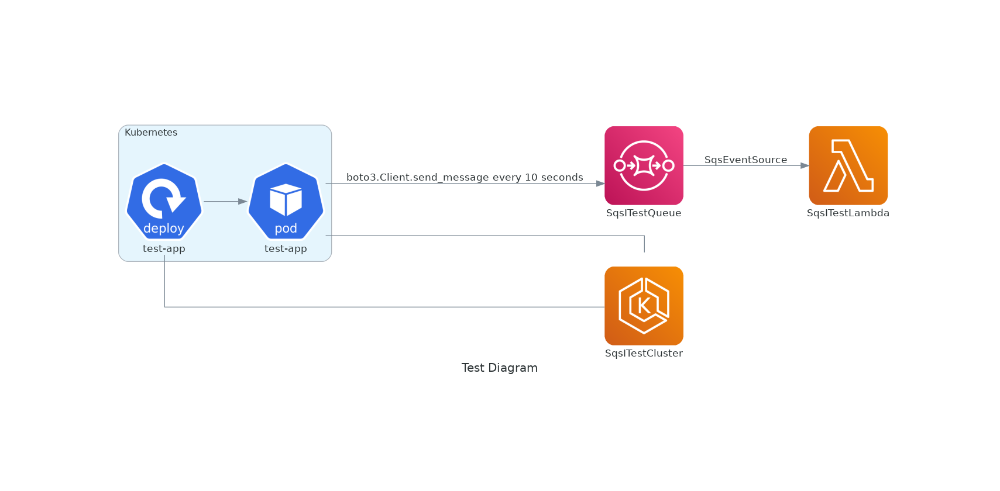

# Amazon EKS (Python) -> SQS -> Lambda Integration test

## Connect via kubectl to EKS

See the [Connect to EKS](../../README.md#connect-to-eks) documentation to get a valid KUBECONFIG to use with `kubectl`.